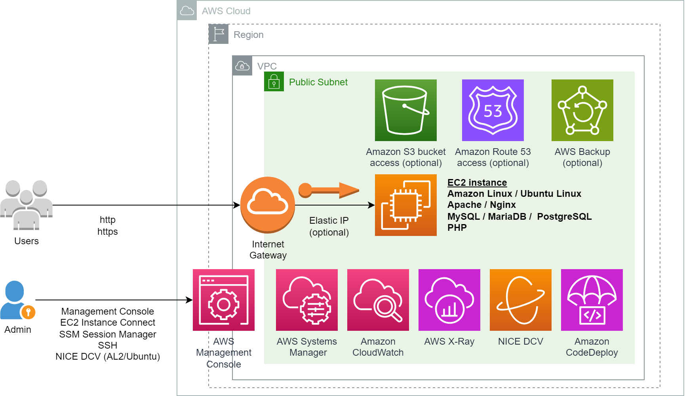

## EC2-LAMP-Server
[AWS CloudFormation](https://aws.amazon.com/cloudformation/) template to provision [Amazon EC2](https://aws.amazon.com/ec2/) web server with Apache/Nginx, PHP and MySQL/MariaDB/PostgreSQL.

## Description
[LAMP](https://aws.amazon.com/what-is/lamp-stack/) is an acronym for the operating system, Linux; the web server, Apache; the database server, MySQL (or MariaDB); and the programming language, PHP. It is a common open source web platform for many of the web's popular applications.  Variations include LEMP which replaces web server with Nginx, LAPP which replaces database server with PostgreSQL, and LEPP which uses Nginx and PostgreSQL. According to [W3Techs](https://w3techs.com/) more than [70%](https://w3techs.com/technologies/overview/programming_language) of websites use PHP.

This repo provides CloudFormation templates to provision EC2 instances with option to specify PHP version, web server engine and database engine. The instances can be used for software development or deployment of PHP based web applications such as [WordPress](https://wordpress.org/) and [Moodle](https://moodle.org/). 


## Architecture Diagram


## Overview of features
The template provides the following features:
- [Amazon Linux 2023](https://aws.amazon.com/linux/amazon-linux-2023/), [Ubuntu](https://ubuntu.com/aws)/[Ubuntu Pro](https://aws.amazon.com/about-aws/whats-new/2023/04/amazon-ec2-ubuntu-pro-subscription-model/) 22.04/24.04, or [Amazon Linux 2](https://aws.amazon.com/amazon-linux-2/)
- Applications
  - [Apache](https://www.apache.org/) or [Nginx](https://www.nginx.com/) web server
  - [MySQL](https://www.mysql.com/), [MariaDB](https://mariadb.org/) or [PostgreSQL](https://www.postgresql.org/) database server
  - PHP
    - Amazon Linux: PHP 8 with additional PECL extensions (imagick, apcu, memcached, redis, igbinary, msgpack, lzf, lz4, zstd, etc) compiled[*](#compiling-php-extensions-on-amazon-linux-2023-al2023)
    - Ubuntu Linux: [PHP 5.6, 7.x or 8.x](https://launchpad.net/~ondrej/+archive/ubuntu/php/) from [Ondřej Surý's](https://deb.sury.org/) [ppa:ondrej/php](https://launchpad.net/~ondrej/+archive/ubuntu/php/) repository
  - [Composer](https://getcomposer.org/)
  - [Redis](https://redis.io/) and [Memcached](https://memcached.org/) in memory database
  - [Certbot](https://certbot.eff.org/) for [free HTTPS certificate](#obtaining-certificate-for-https)
    - [Amazon Route 53](https://aws.amazon.com/route53/) hosted zone access for use with [certbot-dns-route53](https://certbot-dns-route53.readthedocs.io/en/stable/) DNS plugin
  - [Docker Engine](https://docs.docker.com/engine/) (optional)
  - [MountPoint for Amazon S3](https://aws.amazon.com/s3/features/mountpoint/) for mounting S3 bucket as local file system
    - [Amazon S3](https://aws.amazon.com/s3/) bucket access for use with Mountpoint with S3
  - [AWS CLI v2](https://aws.amazon.com/cli/) with [auto-prompt](https://docs.aws.amazon.com/cli/latest/userguide/cli-usage-parameters-prompting.html)
  - [Amazon CloudWatch](https://aws.amazon.com/cloudwatch/) agent
  - [AWS CodeDeploy](https://aws.amazon.com/codedeploy/) agent
- Remote Administration
  - [Amazon DCV](https://aws.amazon.com/hpc/dcv/) remote display protocol server for graphical desktop access (optional)
  - [SSM Session Manager](https://docs.aws.amazon.com/systems-manager/latest/userguide/session-manager.html)  secure shell access 
  - [EC2 Instance Connect](https://docs.aws.amazon.com/AWSEC2/latest/UserGuide/connect-linux-inst-eic.html) in-browser SSH access
  - [Webmin](https://webmin.com/) web-based system administration (optional)
- AWS Services
  - [AWS Backup](https://aws.amazon.com/backup/) to protect EC2 instance data (optional)
  - [Application Load Balancer](https://aws.amazon.com/elasticloadbalancing/application-load-balancer/) with SSL/TLS certificate from [AWS Certificate Manager](https://aws.amazon.com/certificate-manager/) (optional)
  - [Amazon CloudFront](https://aws.amazon.com/cloudfront/) CDN with support for [VPC Origin](https://aws.amazon.com/blogs/networking-and-content-delivery/introducing-cloudfront-virtual-private-cloud-vpc-origins-shield-your-web-applications-from-public-internet/) (optional)

## Notice
Although this repository is released under the [MIT-0](LICENSE) license, its CloudFormation template uses features from 
[MySQL Community Edition](https://www.mysql.com/products/community/) and [Webmin](https://webmin.com/) which are licensed under [GPL](https://www.mysql.com/products/community/) and [BSD-3-Clause](https://webmin.com/about/) license respectively. Usage of [Amazon DCV](https://aws.amazon.com/hpc/dcv/) indicates acceptance of [DCV EULA](https://www.amazondcv.com/eula.html).

By using the template, you accept license agreement of all software that is installed in the EC2 instance. 

### Requirements
- EC2 instance must be provisioned in a subnet with IPv4 internet connectivity. 
- To use [Application Load Balancer (ALB)](https://aws.amazon.com/elasticloadbalancing/application-load-balancer/) with HTTPS, either [request a public certificate](https://docs.aws.amazon.com/acm/latest/userguide/acm-public-certificates.html) or [import a certificate](https://docs.aws.amazon.com/acm/latest/userguide/import-certificate.html) into [AWS Certificate Manager](https://aws.amazon.com/certificate-manager/).


## Deploying using CloudFormation console
Download .yaml file for the desired operating system ([Amazon Linux 2](https://github.com/aws-samples/ec2-lamp-server/blob/main/AmazonLinux-2-LAMP-server.yaml), [Amazon Linux 2023](https://github.com/aws-samples/ec2-lamp-server/blob/main/AmazonLinux-2023-LAMP-server.yaml) or [Ubuntu/Ubuntu Pro](https://github.com/aws-samples/ec2-lamp-server/blob/main/UbuntuLinux-2204-LAMP-server.yaml)) 

Login to AWS [CloudFormation console](https://console.aws.amazon.com/cloudformation/home#/stacks/create/template). Choose **Create Stack**, **Upload a template file**, **Choose File**, select your .YAML file and choose **Next**. Enter a **Stack name** and specify parameters values.

EC2 Instance
- `ec2Name`: EC2 instance name
- `ec2KeyPair`: [EC2 key pair](https://docs.aws.amazon.com/AWSEC2/latest/UserGuide/ec2-key-pairs.html) name. [Create key pair](https://docs.aws.amazon.com/AWSEC2/latest/UserGuide/create-key-pairs.html) if necessary
- `processorArchitecture` / `osVersion` : Intel/AMD x86_64 or Graviton arm64. Default is `Graviton (arm64)`.
- `instanceType`: EC2 [instance types](https://aws.amazon.com/ec2/instance-types/). Do ensure type matches processor architecture. Default is `t4g.xlarge` [burstable instance type](https://aws.amazon.com/ec2/instance-types/t4/). For best performance, consider newer [M7g](https://aws.amazon.com/ec2/instance-types/m7g/) and [M8g](https://aws.amazon.com/ec2/instance-types/m8g/) [Graviton](https://aws.amazon.com/ec2/graviton/) instance
- `ec2TerminationProtection`: enable [EC2 termination protection](https://docs.aws.amazon.com/AWSEC2/latest/UserGuide/Using_ChangingDisableAPITermination.html) to prevent accidental deletion. Default is `Yes`

EC2 Network
- `vpcID`: [VPC](https://docs.aws.amazon.com/vpc/latest/userguide/what-is-amazon-vpc.html) with internet connectivity. Select [default VPC](https://docs.aws.amazon.com/vpc/latest/userguide/default-vpc.html) if unsure
- `subnetID`: subnet with internet connectivity. Select subnet in default VPC if unsure
- `displayPublicIP`: set this to `No` if your EC2 instance will not receive [public IP address](https://docs.aws.amazon.com/AWSEC2/latest/UserGuide/using-instance-addressing.html#concepts-public-addresses). EC2 private IP will be displayed in CloudFormation Outputs section instead. Default is `Yes`
- `assignStaticIP`: associates a static public IPv4 address using [Elastic IP address](https://docs.aws.amazon.com/AWSEC2/latest/UserGuide/elastic-ip-addresses-eip.html). Default is `Yes`

Application Load Balancer (ALB)
- `enableALB`: deploy [Application Load Balancer](https://aws.amazon.com/elasticloadbalancing/application-load-balancer/) with EC2 instance as target. Associated charges are listed on [Elastic Load Balancing pricing](https://aws.amazon.com/elasticloadbalancing/pricing/) page. Default is `No`
- `albScheme`: either `internet-facing` or `internal`. An internet-facing load balancer routes requests from clients to targets over the internet. An internal load balancer routes requests to targets using private IP addresses. Default is `internet-facing`
- `albIpAddressType`: [IP address type](https://docs.aws.amazon.com/elasticloadbalancing/latest/application/application-load-balancers.html#ip-address-type), either `IPv4`, `IPv4-and-IPv6` or `IPv6`. Default is `IPv4`
- `albSubnets`: subnets for ALB. Select at least 2 AZ subnets in EC2 VPC
  
*Select a subnet even if `enableALB` is `No`*

ALB HTTPS listener
- `albCertificateArn`: [AWS Certificate Manager (ACM)](https://aws.amazon.com/certificate-manager/) [certificate ARN](https://docs.aws.amazon.com/acm/latest/userguide/gs-acm-describe.html) for ALB [HTTPS listener](https://docs.aws.amazon.com/elasticloadbalancing/latest/application/create-https-listener.html). Leave blank not to create HTTPS listener
- `albSecurityPolicy`: [Security policy](https://docs.aws.amazon.com/elasticloadbalancing/latest/application/create-https-listener.html#describe-ssl-policies) for HTTPS listener. Default is `ELBSecurityPolicy-TLS13-1-2-2021-06`
- `albRedirectHTTPtoHTTPS`: option to redirect HTTP requests to HTTPS. Default is `Yes`
- `albHstsHeaderValue`: [HSTS (HTTP Strict Transport Security)](https://cheatsheetseries.owasp.org/cheatsheets/HTTP_Strict_Transport_Security_Cheat_Sheet.html) response header value to send. Set empty string not to send HSTS header. Default is `max-age=31536000; includeSubDomains`

*The above options only apply if `enableALB` is `Yes`*

Amazon CloudFront
- `enableCloudFront`: [create](https://docs.aws.amazon.com/AmazonCloudFront/latest/DeveloperGuide/distribution-web-creating-console.html) a [Amazon CloudFront](https://aws.amazon.com/cloudfront/) distribution to your EC2  instance or ALB. Associated charges are listed on [Amazon CloudFront pricing](https://aws.amazon.com/cloudfront/pricing/) page. Default is `No`
- `originType`: either `Custom Origin` or `VPC Origin`. Most [AWS Regions](https://docs.aws.amazon.com/AmazonCloudFront/latest/DeveloperGuide/private-content-vpc-origins.html#vpc-origins-supported-regions) support [VPC Origins](https://aws.amazon.com/blogs/networking-and-content-delivery/introducing-cloudfront-virtual-private-cloud-vpc-origins-shield-your-web-applications-from-public-internet/), which allow CloudFront to deliver content even if your EC2 instance is in a VPC private subnet. Default is `Custom Origin` 

EC2 Remote Administration
- `ingressIPv4`: allowed IPv4 source prefix to remote administration services, e.g. `1.2.3.4/32`. You can get your source IP from [https://checkip.amazonaws.com](https://checkip.amazonaws.com). Default is `0.0.0.0/0`. 
- `ingressIPv6`: allowed IPv6 source prefix to remote administration services. Use `::1/128` to block all incoming IPv6 access. Default is `::/0`
- `allowSSHport`: allow inbound SSH. Option does not affect [EC2 Instance Connect](https://aws.amazon.com/blogs/compute/new-using-amazon-ec2-instance-connect-for-ssh-access-to-your-ec2-instances/) access. Default is `Yes`
- `installDCV`: install graphical desktop environment and [DCV](https://aws.amazon.com/hpc/dcv/) server. Default is `Yes`
- `installWebmin`: install [Webmin](https://webmin.com/) web-based system administration tool. Default is `No`

*SSH, DCV and Webmin inbound access are restricted to `ingressIPv4` and `ingressIPv6` IP prefixes.* 

LAMP
- `webOption`: `Apache` or `Nginx` web server.
- `phpVersion`: PHP version to install or `none`.
- `databaseOption`: `MySQL`, `MariaDB`, `PostgreSQL` database server or `none`. MySQL option for Amazon Linux will attempt to use [MySQL Community Edition](https://www.mysql.com/products/community/) repository, where MySQL root password can be retrieved using the command `sudo grep password /var/log/mysqld.log`. Select `none` if using external database such as [Amazon RDS](https://aws.amazon.com/rds/).
- `s3BucketName` (optional): name of [Amazon S3](https://aws.amazon.com/s3/) bucket to grant EC2 instance access using [IAM policy](https://aws.amazon.com/blogs/security/writing-iam-policies-how-to-grant-access-to-an-amazon-s3-bucket/).  Leave text field empty not to grant access. A `*` value will grant the EC2 instance access to all S3 buckets in your AWS account and is usually not recommended. Default is empty.
- `r53ZoneID` (optional):  [Amazon Route 53](https://aws.amazon.com/route53/) hosted zone ID to grant access for use with Certbot [certbot-dns-route53](#option-2-using-certbot-certbot-dns-route53-plugin) DNS plugin.  A `*` value will grant access to all Route 53 zones in your AWS account. Permission is restricted to **_acme-challenge.\*** TXT DNS records using [resource record set permissions](https://docs.aws.amazon.com/Route53/latest/DeveloperGuide/resource-record-sets-permissions.html). Default is empty string for no access
- `installDocker` (optional):  install [Docker Engine](https://docs.docker.com/engine/) (also known as Docker CE) from [Docker repository](https://download.docker.com/) or Linux OS package repository. Default is `No`


Amazon CloudFront
- `enableCloudFront`: [create](https://docs.aws.amazon.com/AmazonCloudFront/latest/DeveloperGuide/distribution-web-creating-console.html) a [Amazon CloudFront](https://aws.amazon.com/cloudfront/) distribution to your EC2 instance. Associated charges are listed on [Amazon CloudFront pricing](https://aws.amazon.com/cloudfront/pricing/) page. Default is `No`
- `originType`: either `Custom Origin` or `VPC origin`. [VPC Origin](https://aws.amazon.com/blogs/networking-and-content-delivery/introducing-cloudfront-virtual-private-cloud-vpc-origins-shield-your-web-applications-from-public-internet/) allows CloudFront to deliver content even if your EC2 instance or ALB is in a VPC private subnet. Refer to [documentation](https://docs.aws.amazon.com/AmazonCloudFront/latest/DeveloperGuide/private-content-vpc-origins.html#vpc-origins-supported-regions) for supported AWS Regions. Default is `Custom Origin`
 
EBS
- `volumeSize`: [Amazon EBS](https://docs.aws.amazon.com/AWSEC2/latest/UserGuide/AmazonEBS.html) volume size
- `volumeType`: [EBS General Purpose Volume](https://aws.amazon.com/ebs/general-purpose/) type

Backup
- `enableBackup` : EC2 data protection with [AWS Backup](https://aws.amazon.com/backup/). Associated charges are listed on [AWS Backup pricing](https://aws.amazon.com/backup/pricing) page. Default is `Yes`
- `scheduleExpression`: start time of backup using [CRON expression](https://en.wikipedia.org/wiki/Cron#CRON_expression). Default is 1 am
- `scheduleExpressionTimezone`: timezone in which the schedule expression is set. Default is `Etc/UTC`
- `deleteAfterDays`:  number of days after backup creation that a recovery point is deleted. Default is `35`

### CloudFormation Outputs
The following are available on **Outputs** section 
- `EC2console`: EC2 console URL to manage your EC2 instance
- `EC2instanceConnect`: [EC2 Instance Connect](https://aws.amazon.com/blogs/compute/new-using-amazon-ec2-instance-connect-for-ssh-access-to-your-ec2-instances/) URL. Functionality is only available under [certain conditions](https://docs.aws.amazon.com/AWSEC2/latest/UserGuide/connect-linux-inst-eic.html)
- `EC2serialConsole`: [EC2 Serial Console](https://aws.amazon.com/blogs/aws/troubleshoot-boot-and-networking-issues-with-new-ec2-serial-console/) URL. Functionality is available under [certain conditions](https://docs.aws.amazon.com/AWSEC2/latest/UserGuide/ec2-serial-console-prerequisites.html).
- `EC2iamRole`: [IAM role](https://docs.aws.amazon.com/IAM/latest/UserGuide/id_roles_use_switch-role-ec2.html) URL link to manage permissions
- `SSMsessionManager` or `SSMsessionManagerDCV`: [SSM Session Manager](https://aws.amazon.com/blogs/aws/new-session-manager/) URL 
- `WebUrl`: EC2 web server URL

If `installDCV` is `Yes`
- `DCVwebConsole` : DCV web browser client URL. Native DCV clients can be downloaded from [https://www.amazondcv.com/](https://www.amazondcv.com/). Login as the user specified in *Description* field.

If `installWebmin` is `Yes`
- `WebminUrl` : Webmin URL link. Set the root password by running `sudo passwd root` using `EC2instanceConnect`, `SSMsessionManager` or SSH session first

If `enableALB` is `Yes`
- `AlbConsole`: ALB console URL
- `AlbDnsName`: ALB domain name. Create a DNS CNAME or [Route 53 alias](https://docs.aws.amazon.com/Route53/latest/DeveloperGuide/resource-record-sets-choosing-alias-non-alias.html) to ALB domain name especially if you are using HTTPS listener

If `enableCloudFront` is `Yes`
- `CloudFrontConsole` : CloudFront console URL link
- `CloudFrontURL` : CloudFront distribution URL, e.g. `https://d111111abcdef8.cloudfront.net`


### Troubleshooting
To troubleshoot any installation issue, you can view contents of the following log files (if available)
- `/var/log/cloud-init-output.log`
- `/var/log/install-cfn-helper.log`
- `/var/log/install-sw.log`
- `/var/log/install-php.log`
- `/var/log/install-lamp.log`
- `/var/log/install-dcv.log`

## PHP performance configuration
Based on public articles about PHP performance (many thanks to the authors), the following enhancements were made:

- Default processor architecture is [Graviton](https://aws.amazon.com/ec2/graviton/) as per [Improving performance of PHP for Arm64 and impact on AWS Graviton2 based EC2 instances](https://aws.amazon.com/blogs/compute/improving-performance-of-php-for-arm64-and-impact-on-amazon-ec2-m6g-instances/) and [arm64 vs x86_64 for php](https://fraudmarc.com/post/arm64-vs-x86-64-for-php)
- PHP [OPcache](https://www.php.net/manual/en/book.opcache.php) and [JIT](https://php.watch/versions/8.0/JIT) enabled: from [Make your PHP 8 apps twice as fast (OPCache & JIT)](https://medium.com/@edouard.courty/make-your-php-8-apps-twice-as-fast-opcache-jit-8d3542276595)
- [FastCGI Process Manager (FPM)](https://www.php.net/manual/en/install.fpm.php): from [PHP-FPM Cuts Web App Loading Times by 300%](https://www.cloudways.com/blog/php-fpm-on-cloud/)
- [Apache MPM Event](https://httpd.apache.org/docs/2.4/mod/event.html): from [Apache Performance Tuning: MPM Modules](https://www.liquidweb.com/kb/apache-performance-tuning-apache-mpm-modules/#best)
- Redis session store: from [Highly Performant PHP Sessions with Redis](https://levelup.gitconnected.com/highly-performant-php-sessions-with-redis-b2dc17b4f4e4)
- Serialisation (igbinary,msgpack) and compression (lzf,zstd,lz4) extensions to reduce Redis/Memcached network traffic: from [Strategies for Reducing Big Redis Traffic in Laravel](https://world.hey.com/otar/strategies-for-reducing-big-redis-traffic-in-laravel-a168f96a)
- PHP [OPcache file cache](https://www.php.net/manual/en/opcache.configuration.php#ini.opcache.file-cache) configured as per [PHP Opcache file cache](https://patrickkerrigan.uk/blog/php-opcache-file-cache/) but not enabled. To enable, edit `/etc/php.d/10-opcache.ini` (Amazon Linux) or `/etc/php/`*`phpVersion`*`/fpm/php.ini` (Ubuntu) file to uncomment the line beginning with `opcache.file_cache=/var/www/.opcache` and restart php-fpm.

## Obtaining certificate for HTTPS
Amazon CloudFront (`enableCloudFront`) [supports](https://docs.aws.amazon.com/AmazonCloudFront/latest/DeveloperGuide/using-https-viewers-to-cloudfront.html) HTTPS. You can use [AWS Certificate Manager](https://aws.amazon.com/certificate-manager/) to [request](https://docs.aws.amazon.com/acm/latest/userguide/acm-public-certificates.html) a public certificate for your own domain and [associate](https://docs.aws.amazon.com/AmazonCloudFront/latest/DeveloperGuide/cnames-and-https-requirements.html) it with your CloudFront distribution.

The EC2 instance uses a self-signed certificate for HTTPS. You can use [Certbot](https://certbot.eff.org/pages/about) to obtain and install [Let's Encrypt](https://letsencrypt.org/) certificate on your web server.

### Certbot prerequisites
Ensure you have a domain name whose DNS entry resolves to your EC2 instance IP address. If you do not have a domain, you can [register a new domain](https://docs.aws.amazon.com/Route53/latest/DeveloperGuide/domain-register.html#domain-register-procedure-section) using [Amazon Route 53](https://aws.amazon.com/route53/) and [create a DNS A record](https://docs.aws.amazon.com/Route53/latest/DeveloperGuide/resource-record-sets-creating.html).

### Using apache plugin

- From terminal, run the below command and follow instructions.
  ```
  sudo certbot --apache
  ```
  
### Using nginx plugin

- From terminal, run the below command and follow instructions.
  ```
  sudo certbot --nginx
  ```

  *Apache and Nginx plugin uses [HTTP-01 challenge](https://letsencrypt.org/docs/challenge-types/#http-01-challenge), and require HTTP port 80 to be accessible from public internet*

### Using certbot-dns-route53 plugin 
The [certbot-dns-route53](https://certbot-dns-route53.readthedocs.io/en/stable/) option requires your DNS to be hosted by Route 53. It supports wildcard certificates and domain names that resolve to private IP addresses.  Ensure that Route 53 zone access is granted by specifying `r53ZoneID` value. From terminal, run the below command based on installed web server type and follow instructions.

- Apache
  ```
  sudo certbot --dns-route53 --installer apache
  ```
- Nginx
  ```
  sudo certbot --dns-route53 --installer nginx
  ```
  

Refer to Certbot site for [help](https://certbot.eff.org/pages/help) with this tool.  


## Using Cloudwatch agent
[Amazon CloudWatch agent](https://docs.aws.amazon.com/AmazonCloudWatch/latest/monitoring/Install-CloudWatch-Agent.html) is installed, and enables collection of [EC2 system-level metrics](https://docs.aws.amazon.com/AmazonCloudWatch/latest/monitoring/metrics-collected-by-CloudWatch-agent.html) and [AWS X-Ray](https://aws.amazon.com/xray/) traces. 

The template configures agent to collect memory utilization metrics. You can configure Cloudwatch agent to collect other data as follows.

### Create agent configuration file
Create agent configuration file. You can use [agent configuration file wizard](https://docs.aws.amazon.com/AmazonCloudWatch/latest/monitoring/create-cloudwatch-agent-configuration-file-wizard.html):
```
sudo /opt/aws/amazon-cloudwatch-agent/bin/amazon-cloudwatch-agent-config-wizard
```
### Start Cloudwatch agent
After `config.json` file is created, [start CloudWatch agent](https://docs.aws.amazon.com/AmazonCloudWatch/latest/monitoring/install-CloudWatch-Agent-on-EC2-Instance-fleet.html#start-CloudWatch-Agent-EC2-fleet):
```
sudo systemctl enable amazon-cloudwatch-agent
sudo /opt/aws/amazon-cloudwatch-agent/bin/amazon-cloudwatch-agent-ctl -a fetch-config -m ec2 -s -c file:/opt/aws/amazon-cloudwatch-agent/bin/config.json
```

Refer to [How do I install and configure the unified CloudWatch agent to push metrics and logs from my EC2 instance to CloudWatch?](https://repost.aws/knowledge-center/cloudwatch-push-metrics-unified-agent) for more details.

## Compiling PHP extensions on Amazon Linux 2023 (AL2023)
If you are looking to compile PHP extensions on AL2023, refer to community article [How do I compile PHP extensions on Amazon Linux 2023?](https://repost.aws/articles/ARM9q-NiODRKC9V7N_jJnNbg/how-do-i-compile-php-extensions-on-amazon-linux-2023)

## About EC2 instance

### Well-architected
To improve performance, reliability, scalability, high availability and functionality, EC2 instance can be extended to use other services such as [Amazon RDS](https://aws.amazon.com/rds/), [Amazon S3](https://aws.amazon.com/s3/), [Amazon ElastiCache](https://aws.amazon.com/elasticache/) and [Amazon EFS](https://aws.amazon.com/efs/), and with [AWS SDK for PHP](https://aws.amazon.com/sdk-for-php/). Some useful resources that can help with the integration include:
- [AWS Well-Architected](https://aws.amazon.com/architecture/well-architected/)
- [AWS Architecture Center](https://aws.amazon.com/architecture) including [Scaling PHP Applications on AWS](https://d1.awsstatic.com/architecture-diagrams/ArchitectureDiagrams/scaling-PHP-applications-on-AWS-ra.pdf)
- [PHP on AWS](https://aws.amazon.com/developer/language/php/)
- [Moodle Reference Architecture](https://docs.aws.amazon.com/architecture-diagrams/latest/moodle-learning-management-system-on-aws/moodle-learning-management-system-on-aws.html)
- [Best Practices for WordPress on AWS](https://docs.aws.amazon.com/whitepapers/latest/best-practices-wordpress/reference-architecture.html)

### Restoring from backup
If you enable AWS Backup, you can restore your [EC2 instance](https://docs.aws.amazon.com/aws-backup/latest/devguide/restoring-ec2.html) from recovery points (backups) in your [backup vault](https://docs.aws.amazon.com/aws-backup/latest/devguide/vaults.html). The CloudFormation template creates an IAM role that grants AWS Backup permission to restore your backups. Role name can be located in your CoudFormation stack Resources section as the Physical ID value whose Logical ID value is `backupRestoreRole`


### Securing
To futher secure your EC2 instance, you may want to
- Restrict remote administration access to your IP address only (`ingressIPv4` and `ingressIPv6`)
- For DCV (`installDCV`)
  - Use [native clients](https://www.amazondcv.com/) for remote access, and disable web browser client by removing `nice-dcv-web-viewer` package
- Disable SSH access from public internet (`allowSSHport`)
  - Use [EC2 Instance Connect](https://docs.aws.amazon.com/AWSEC2/latest/UserGuide/ec2-instance-connect-methods.html#ec2-instance-connect-connecting-console) or [SSM Session Manager](https://docs.aws.amazon.com/systems-manager/latest/userguide/session-manager-working-with-sessions-start.html#start-ec2-console) for in-browser terminal access, or 
  - Start a session using [AWS CLI](https://docs.aws.amazon.com/systems-manager/latest/userguide/session-manager-working-with-sessions-start.html#sessions-start-cli) or [SSH](https://docs.aws.amazon.com/systems-manager/latest/userguide/session-manager-working-with-sessions-start.html#sessions-start-ssh) with [Session Manager plugin for the AWS CLI](https://docs.aws.amazon.com/systems-manager/latest/userguide/session-manager-working-with-install-plugin.html)
- Use AWS Backup (`enableBackup`)
  - Enable [AWS Backup Vault Lock](https://aws.amazon.com/blogs/storage/enhance-the-security-posture-of-your-backups-with-aws-backup-vault-lock/) to prevent your backups from accidental or malicious deletion, and for [protection from ransomware](https://aws.amazon.com/blogs/security/updated-ebook-protecting-your-aws-environment-from-ransomware/)
- Deploy EC2 instance in a private subnet
  - Use [Application Load Balancer](https://aws.amazon.com/elasticloadbalancing/application-load-balancer/) (`enableALB`) or  [Amazon CloudFront](https://aws.amazon.com/cloudfront/) (`enableCloudFront`) with [VPC Origin](https://aws.amazon.com/blogs/aws/introducing-amazon-cloudfront-vpc-origins-enhanced-security-and-streamlined-operations-for-your-applications/) for public internet access
  -  Use [AWS Certificate Manager](https://aws.amazon.com/certificate-manager/) to [request a public HTTPS certificate](https://docs.aws.amazon.com/acm/latest/userguide/acm-public-certificates.html) and associate it with your [Application Load Balancer](https://repost.aws/knowledge-center/associate-acm-certificate-alb-nlb) or [CloudFront distribution](https://docs.aws.amazon.com/AmazonCloudFront/latest/DeveloperGuide/cnames-and-https-requirements.html)
  - Use [AWS WAF](https://aws.amazon.com/waf/) to protect your [CloudFront distribution](https://docs.aws.amazon.com/AmazonCloudFront/latest/DeveloperGuide/distribution-web-awswaf.html) or [Application Load Balancer](https://repost.aws/knowledge-center/waf-protect-ec2-instance)
- With Amazon CloudFront
  - Additional inbound HTTP and HTTPS security groups with [AWS-managed prefix list for Amazon CloudFront](https://aws.amazon.com/blogs/networking-and-content-delivery/limit-access-to-your-origins-using-the-aws-managed-prefix-list-for-amazon-cloudfront/) as source are created. You can remove public internet inbound (`0.0.0.0/0`)  HTTP/HTTPS from your security group
- Enable [Amazon Inspector](https://aws.amazon.com/inspector/) to [scan EC2 instance](https://docs.aws.amazon.com/inspector/latest/user/scanning-ec2.html) for software vulnerabilities and unintended network exposure.
- Enable [Amazon GuardDuty](https://aws.amazon.com/guardduty/) security monitoring service with [Runtime Monitoring](https://docs.aws.amazon.com/guardduty/latest/ug/how-runtime-monitoring-works-ec2.html) and [Malware Protection for EC2](https://docs.aws.amazon.com/guardduty/latest/ug/malware-protection.html)


## Clean Up
To remove created resources, you will need to
- [Delete](https://docs.aws.amazon.com/aws-backup/latest/devguide/deleting-backups.html) any recovery points in created backup vault
- [Disable](https://docs.aws.amazon.com/AWSEC2/latest/UserGuide/Using_ChangingDisableAPITermination.html) EC2 instance termination protection (if enabled)
- [Delete](https://docs.aws.amazon.com/AWSCloudFormation/latest/UserGuide/cfn-console-delete-stack.html) CloudFormation stack


## Security

See [CONTRIBUTING](CONTRIBUTING.md#security-issue-notifications) for more information.

## License

This library is licensed under the MIT-0 License. See the LICENSE file.

