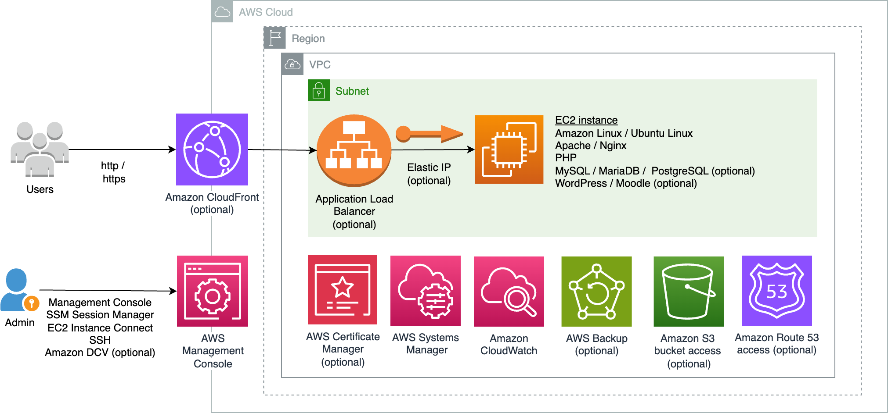

## ec2-lamp-server
[AWS CloudFormation](https://aws.amazon.com/cloudformation/) templates to provision [Amazon EC2](https://aws.amazon.com/ec2/) instance with LAMP, LEMP, LAPP or LEPP stack.

## Description
[LAMP](https://aws.amazon.com/what-is/lamp-stack/) is an acronym for the operating system, Linux; the web server, Apache; the database server, MySQL (or MariaDB); and the programming language, PHP. It is a common open source web platform for many of the web's popular applications.  Variations include LEMP which replaces web server with Nginx, LAPP which replaces database server with PostgreSQL, and LEPP which uses Nginx and PostgreSQL. According to [W3Techs](https://w3techs.com/), PHP is used by more than [70%](https://w3techs.com/technologies/overview/programming_language), and either Nginx or Apache is used by more than [60%](https://w3techs.com/technologies/overview/web_server) of websites as of 2023.

This repo provides CloudFormation template to provision a EC2 instance with option to specify PHP version, web server engine (Apache or Nginx) and database engine (MySQL, MariaDB or PostgreSQL) to install. The EC2 instance can be used for software development or deployment of PHP based web applications such as [WordPress](https://wordpress.org/) and [Moodle](https://moodle.org/). 

To improve performance, reliability, scalability, high availability and functionality, EC2 instance can be extended to use other services such as [Amazon RDS](https://aws.amazon.com/rds/), [Amazon S3](https://aws.amazon.com/s3/), [Amazon ElastiCache](https://aws.amazon.com/elasticache/) and [Amazon EFS](https://aws.amazon.com/efs/), and with [AWS SDK for PHP](https://aws.amazon.com/sdk-for-php/). Some useful resources that can help with the integration include:
- [AWS Well-Architected](https://aws.amazon.com/architecture/well-architected/)
- [AWS Architecture Center](https://aws.amazon.com/architecture) including [Scaling PHP Applications on AWS](https://d1.awsstatic.com/architecture-diagrams/ArchitectureDiagrams/scaling-PHP-applications-on-AWS-ra.pdf)
- [PHP on AWS](https://aws.amazon.com/developer/language/php/)
- [Moodle Reference Architecture](https://docs.aws.amazon.com/architecture-diagrams/latest/moodle-learning-management-system-on-aws/moodle-learning-management-system-on-aws.html)
- [Best Practices for WordPress on AWS](https://docs.aws.amazon.com/whitepapers/latest/best-practices-wordpress/reference-architecture.html)

## Architecture Diagram


## Overview of features
The template provides the following features:
- Graphical desktop with [NICE DCV](https://aws.amazon.com/hpc/dcv/) server for secure remote access (Amazon Linux 2 and Ubuntu Linux)
- [Apache](https://www.apache.org/) or [Nginx](https://www.nginx.com/) web server
- [MySQL](https://www.mysql.com/), [MariaDB](https://mariadb.org/) or [PostgreSQL](https://www.postgresql.org/) database server
- [PHP 8.1](https://www.php.net/releases/8.1/en.php) or [PHP 8.2](https://www.php.net/releases/8.2/en.php)(Amazon Linux 2 and 2023) with common PHP extensions (including imagick, apcu, memcached, redis, igbinary, msgpack, lzf, lz4, zstd, libsodium, xdebug, zip for Amazon Linux)
- [Composer](https://getcomposer.org/)
- [Redis](https://redis.io/) and [Memcached](https://memcached.org/) in memory database
- [EC2 Instance Connect](https://docs.aws.amazon.com/AWSEC2/latest/UserGuide/connect-linux-inst-eic.html) for SSH access
- [SSM Session Manager](https://docs.aws.amazon.com/systems-manager/latest/userguide/session-manager.html) for secure shell access 
- [AWS CodeDeploy](https://aws.amazon.com/codedeploy/) agent
- [Amazon CloudWatch](https://aws.amazon.com/cloudwatch/) agent
- [NFS](https://aws.amazon.com/efs/) client
- [AWS CLI v2](https://aws.amazon.com/cli/) with [auto-prompt](https://docs.aws.amazon.com/cli/latest/userguide/cli-usage-parameters-prompting.html)
- [MountPoint for Amazon S3](https://aws.amazon.com/blogs/aws/mountpoint-for-amazon-s3-generally-available-and-ready-for-production-workloads/) 
- (Optional) [Amazon S3](https://aws.amazon.com/s3/) bucket access via [EC2 IAM role](https://docs.aws.amazon.com/AWSEC2/latest/UserGuide/iam-roles-for-amazon-ec2.html)
- [Certbot](https://certbot.eff.org/) with apache, nginx and certbot-dns-route53 plugins
- (Optional) [Amazon Route 53](https://aws.amazon.com/route53/) hosted zone access via [EC2 IAM role](https://docs.aws.amazon.com/AWSEC2/latest/UserGuide/iam-roles-for-amazon-ec2.html) for use with certbot-dns-route53 plugin

Note that use of cloudformation template indicates acceptance of license agreements of all software that is installed in the EC2 instance. 

## Deployment via CloudFormation console
Download .yaml file for the desired operating system ([Amazon Linux 2](https://github.com/aws-samples/ec2-lamp-server/blob/main/AmazonLinux-2-LAMP-server.yaml), [Amazon Linux 2023](https://github.com/aws-samples/ec2-lamp-server/blob/main/AmazonLinux-2023-LAMP-server.yaml) or [Ubuntu Linux 22.04 LTS server](https://github.com/aws-samples/ec2-lamp-server/blob/main/UbuntuLinux-2204-LAMP-server.yaml)) 

Login to AWS [CloudFormation console](https://console.aws.amazon.com/cloudformation/home#/stacks/create/template). Choose **Create Stack**, **Upload a template file**, **Choose File**, select your .YAML file and choose **Next**. Enter a **Stack name** and specify parameters values. All 

EC2
- `processorArchitecture`: Intel/AMD or Graviton ARM64. Default is `Graviton ARM64 (aarch64)`
- `instanceType`: EC2 [instance types](https://aws.amazon.com/ec2/instance-types/). Do ensure type matches processor architecture. Default is `t4g.large` [burstable instance type](https://aws.amazon.com/ec2/instance-types/t4/). For best performance, consider newer generation instance types such [M6g](https://aws.amazon.com/ec2/instance-types/m6g/) or [M7g](https://aws.amazon.com/ec2/instance-types/m7g/)
- `ec2Name`: EC2 instance name 
- `ec2KeyPair`: [EC2 key pair](https://docs.aws.amazon.com/AWSEC2/latest/UserGuide/ec2-key-pairs.html) name. [Create key pair](https://docs.aws.amazon.com/AWSEC2/latest/UserGuide/create-key-pairs.html) if necessary
- `volumeSize`: [Amazon EBS](https://docs.aws.amazon.com/AWSEC2/latest/UserGuide/AmazonEBS.html) volume size
- `volumeType`: [EBS General Purpose Volume](https://aws.amazon.com/ebs/general-purpose/) type

VPC
- `vpcID`: [VPC](https://docs.aws.amazon.com/vpc/latest/userguide/what-is-amazon-vpc.html) with internet connectivity. Select [default VPC](https://docs.aws.amazon.com/vpc/latest/userguide/default-vpc.html) if unsure
- `subnetID`: subnet with internet connectivity. Select subnet in default VPC if unsure
- `displayPublicIP`: set this to `No` if your EC2 instance will not receive [public IP address](https://docs.aws.amazon.com/AWSEC2/latest/UserGuide/using-instance-addressing.html#concepts-public-addresses). EC2 private IP will be displayed in CloudFormation Outputs section instead. Default is `Yes`
- `assignStaticIP`: associates a static public IPv4 address using [Elastic IP address](https://docs.aws.amazon.com/AWSEC2/latest/UserGuide/elastic-ip-addresses-eip.html). Default is `Yes`

LAMP configuration
- `webOption`: `Apache`, `Nginx` web server or `none`.
- `phpVersion`: PHP version to install or `none`
- `databaseOption`: `MySQL`, `MariaDB`, `PostgreSQL` database server or `none`. MySQL option for Amazon Linux 2 and Amazon Linux 2023 uses [MySQL Community Edition](https://www.mysql.com/products/community/) repository, where MySQL root password can be retrieved using the command `sudo grep password /var/log/mysqld.log`. Select `none` if using external database such as [Amazon RDS](https://aws.amazon.com/rds/).
- `s3BucketName` (optional): name of [Amazon S3](https://aws.amazon.com/s3/) bucket to grant EC2 instance to [via IAM policy](https://aws.amazon.com/blogs/security/writing-iam-policies-how-to-grant-access-to-an-amazon-s3-bucket/).  Leave text field empty not to grant access. A `*` value will grant the EC2 instance access to all S3 buckets in your AWS account and is usually not recommended. Default is empty.
- `r53ZoneID` (optional): [Amazon Route 53](https://aws.amazon.com/route53/) hosted zone ID to grant access to. Enable this if your DNS is on Route 53 and you want to use Certbot with [certbot-dns-route53](https://certbot-dns-route53.readthedocs.io/) plugin to get HTTPS certificate. A `*` value will grant access to all Route 53 zones in your AWS account. Permission is restricted to TXT DNS records only using [resource record set permissions](https://docs.aws.amazon.com/Route53/latest/DeveloperGuide/resource-record-sets-permissions.html). Default is empty. 

Remote Administration
- `ingressIPv4`: allowed IPv4 internet source prefix to SSH and NICE DCV ports, e.g. `1.2.3.4/32`. You can get your source IP from [https://checkip.amazonaws.com](https://checkip.amazonaws.com). Use `127.0.0.1/32` to block incoming access from public internet. Default is `0.0.0.0/0`. 
- `ingressIPv6`: allowed IPv6 internet source prefix to SSH and NICE DCV ports. Use `::1/128` to block all incoming IPv6 access. Default is `::/0`

### CloudFormation Outputs
The following are available on **Outputs** section 
- `EC2console`: EC2 console URL link to start/stop your EC2 instance or to get the latest IPv4 (or IPv6 if enabled) address.
- `EC2instanceConnect`: [EC2 Instance Connect](https://aws.amazon.com/blogs/compute/new-using-amazon-ec2-instance-connect-for-ssh-access-to-your-ec2-instances/) URL link. This feature may not be available in your Region, and only works if you allow SSH access from your Region [EC2 instance connect IP prefixes](#ec2-instance-connect-ip-prefixes).
- `SSMsessionManager`: SSM Session Manager URL link for secure [shell access](https://aws.amazon.com/blogs/aws/new-session-manager/). Use this to change NICE DCV login user password. Password change command (if any) is in *Description* field.
- `WebUrl`: EC2 web server URL link
- `DCVwebConsole`: NICE DCV web browser client URL link#. Login as the user specified in *Description* field 


#Native NICE DCV clients can be downloaded from [https://download.nice-dcv.com/](https://download.nice-dcv.com/).
Web browser client can be disabled by removing `nice-dcv-web-viewer` package.


### PHP performance configuration
Based on public articles about PHP performance (many thanks to the authors), the following enhancements were made:

- PHP [OPcache](https://www.php.net/manual/en/book.opcache.php) and [JIT](https://php.watch/versions/8.0/JIT) enabled: from [Make your PHP 8 apps twice as fast (OPCache & JIT)](https://medium.com/@edouard.courty/make-your-php-8-apps-twice-as-fast-opcache-jit-8d3542276595)
- [FastCGI Process Manager (FPM)](https://www.php.net/manual/en/install.fpm.php): from [PHP-FPM Cuts Web App Loading Times by 300%](https://www.cloudways.com/blog/php-fpm-on-cloud/) 
- [Apache MPM Event](https://httpd.apache.org/docs/2.4/mod/event.html): from [Apache Performance Tuning: MPM Modules](https://www.liquidweb.com/kb/apache-performance-tuning-apache-mpm-modules/#best)
- Redis session store: from [Highly Performant PHP Sessions with Redis](https://levelup.gitconnected.com/highly-performant-php-sessions-with-redis-b2dc17b4f4e4)
- Serialisation (igbinary,msgpack) and compression (lzf,zstd,lz4) extensions to reduce Redis/Memcached network traffic: from [Strategies for Reducing Big Redis Traffic in Laravel](https://world.hey.com/otar/strategies-for-reducing-big-redis-traffic-in-laravel-a168f96a)

CloudFormation default processor architecture option is [Graviton](https://aws.amazon.com/ec2/graviton/) as per [arm64 vs x86_64 for php](https://fraudmarc.com/post/arm64-vs-x86-64-for-php). 


## Using Certbot to obtain HTTPS certificate
Refer to [Certbot site](https://certbot.eff.org/pages/about) for [help](https://certbot.eff.org/pages/help) with this tool.  

Create a DNS record entry that resolves to your EC2 instance IP address, and ensure `assignStaticIP` is configured to `Yes` in your CloudFormation stack. 


### Using certbot-dns-route53 plugin 

Ensure that you have granted Route 53 hosted zone access by specifying `r53ZoneID` value in your CloudFormation stack. From terminal, run the below command based on installed web server type and follow instructions.

- Apache
  ```
  sudo certbot --dns-route53 --installer apache
  ```
- Nginx
  ```
  sudo certbot --dns-route53 --installer nginx
  ```
  

### Using apache plugin

- From terminal, run the below command and follow instructions.
  ```
  sudo certbot --apache
  ```
  
### Using nginx plugin

- From terminal, run the below command and follow instructions.
  ```
  sudo certbot --nginx
  ```
  


### About certbot plugins
Both apache and nginx plugins use [HTTP-01 challenge type](https://letsencrypt.org/docs/challenge-types/#http-01-challenge). certbot-dns-route53 plugin uses [DNS-01 challenge type](https://letsencrypt.org/docs/challenge-types/#dns-01-challenge) and supports wildcard certificates. Refer to [Certbot documentation](https://letsencrypt.org/docs/) for more information.


## Securing your EC2 instance
To futher secure your EC2 instance, you may want to
- Restrict or disable SSH inbound from the internet by modifying your Security Groups. For supported Regions, you can restrict SSH access to [EC2 console](https://docs.aws.amazon.com/AWSEC2/latest/UserGuide/ec2-instance-connect-methods.html#ec2-instance-connect-connecting-console) and [AWS CLI](https://docs.aws.amazon.com/AWSEC2/latest/UserGuide/ec2-instance-connect-methods.html#connect-linux-inst-eic-cli-ssh) by specifying [EC2 Instance Connect IP Prefixes](#ec2-instance-connect-ip-prefixes) only.  SSH access using [SSM Session Manager](https://docs.aws.amazon.com/systems-manager/latest/userguide/session-manager-working-with-sessions-start.html#start-ec2-console) does not require inbound SSH access in security group. If you have [Session Manager plugin for the AWS CLI](https://docs.aws.amazon.com/systems-manager/latest/userguide/session-manager-working-with-install-plugin.html) and [AWS CLI](https://docs.aws.amazon.com/cli/latest/userguide/getting-started-install.html) installed, you can start a session using [AWS CLI](https://docs.aws.amazon.com/systems-manager/latest/userguide/session-manager-working-with-sessions-start.html#sessions-start-cli) or [SSH](https://docs.aws.amazon.com/systems-manager/latest/userguide/session-manager-working-with-sessions-start.html#sessions-start-ssh).
- Use [Amazon CloudFront](https://aws.amazon.com/cloudfront/) with [AWS WAF](https://docs.aws.amazon.com/AmazonCloudFront/latest/DeveloperGuide/distribution-web-awswaf.html) to protect your instance from DDoS attacks and common web threats. The [CloudFront dynamic websites](https://github.com/aws-samples/amazon-cloudfront-dynamic-websites) CloudFormation template may help with initial CloudFront distribution setup.
- Backup data on your EBS volumes with [EBS snapshots](https://docs.aws.amazon.com/AWSEC2/latest/UserGuide/EBSSnapshots.html). You can setup automatic snapshots using [Amazon Data Lifecycle Manager](https://aws.amazon.com/blogs/storage/automating-amazon-ebs-snapshot-and-ami-management-using-amazon-dlm/) or [AWS Backup](https://aws.amazon.com/blogs/aws/aws-backup-ec2-instances-efs-single-file-restore-and-cross-region-backup/) (with [AWS Backup Vault Lock](https://aws.amazon.com/blogs/storage/enhance-the-security-posture-of-your-backups-with-aws-backup-vault-lock/) for enhanced security posture)
- Enable [Amazon GuardDuty](https://aws.amazon.com/guardduty/) security monitoring service (with [Malware Protection](https://docs.aws.amazon.com/guardduty/latest/ug/malware-protection.html) to scan for malware)

### EC2 Instance Connect IP prefixes
AWS IP prefixes used by EC2 instance connect are [documented](https://docs.aws.amazon.com/vpc/latest/userguide/aws-ip-ranges.html) in [ip-ranges.json](https://ip-ranges.amazonaws.com/ip-ranges.json) where .service is `EC2_INSTANCE_CONNECT`. You can retrieve IP prefix for your [AWS Region](https://docs.aws.amazon.com/AWSEC2/latest/UserGuide/using-regions-availability-zones.html#concepts-available-regions) (e.g. ap-southeast-1) using the following command


```
curl -s https://ip-ranges.amazonaws.com/ip-ranges.json | \
jq -r '.prefixes[] | select (.service=="EC2_INSTANCE_CONNECT" and .region=="ap-southeast-1")'
```

Output as follows
```
{
  "ip_prefix": "3.0.5.32/29",
  "region": "ap-southeast-1",
  "service": "EC2_INSTANCE_CONNECT",
  "network_border_group": "ap-southeast-1"
}
```
Below is the current list as of October 2023. Do use the command above to get up-to-date IP prefix. 
|	Region	|	IpPrefix	|
|	------	|	--------	|
|	cn-north-1	|	43.196.20.40/29	|
|	cn-northwest-1	|	43.192.155.8/29	|
|	us-gov-east-1	|	18.252.4.0/30	|
|	us-gov-west-1	|	15.200.28.80/30	|
|	af-south-1	|	13.244.121.196/30	|
|	ap-east-1	|	43.198.192.104/29	|
|	ap-northeast-1	|	3.112.23.0/29	|
|	ap-northeast-2	|	13.209.1.56/29	|
|	ap-northeast-3	|	15.168.105.160/29	|
|	ap-south-1	|	13.233.177.0/29	|
|	ap-south-2	|	18.60.252.248/29	|
|	ap-southeast-1	|	3.0.5.32/29	|
|	ap-southeast-2	|	13.239.158.0/29	|
|	ap-southeast-3	|	43.218.193.64/29	|
|	ap-southeast-4	|	16.50.248.80/29	|
|	ca-central-1	|	35.183.92.176/29	|
|	eu-central-1	|	3.120.181.40/29	|
|	eu-central-2	|	16.63.77.8/29	|
|	eu-north-1	|	13.48.4.200/30	|
|	eu-south-1	|	15.161.135.164/30	|
|	eu-south-2	|	18.101.90.48/29	|
|	eu-west-1	|	18.202.216.48/29	|
|	eu-west-2	|	3.8.37.24/29	|
|	eu-west-3	|	35.180.112.80/29	|
|	me-central-1	|	3.29.147.40/29	|
|	me-south-1	|	16.24.46.56/29	|
|	sa-east-1	|	18.228.70.32/29	|
|	us-east-1	|	18.206.107.24/29	|
|	us-east-2	|	3.16.146.0/29	|
|	us-west-1	|	13.52.6.112/29	|
|	us-west-2	|	18.237.140.160/29	|


IP prefixes can also be retrieved using [AWS Tools for PowerShell](https://aws.amazon.com/powershell/) with the following command
```
Get-AWSPublicIpAddressRange -ServiceKey EC2_INSTANCE_CONNECT | Select Region, IpPrefix
```

## Security

See [CONTRIBUTING](CONTRIBUTING.md#security-issue-notifications) for more information.

## License

This library is licensed under the MIT-0 License. See the LICENSE file.

